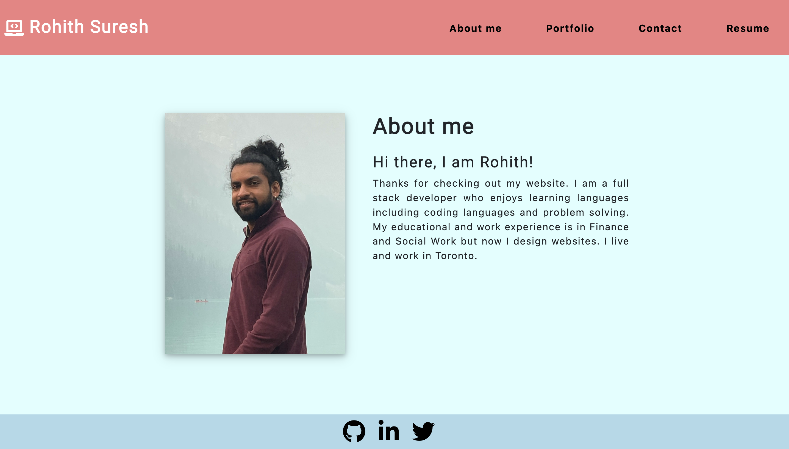
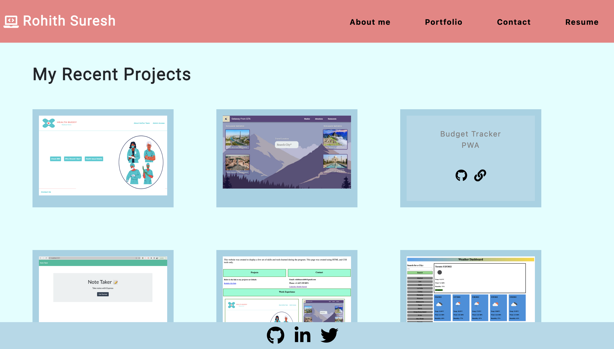
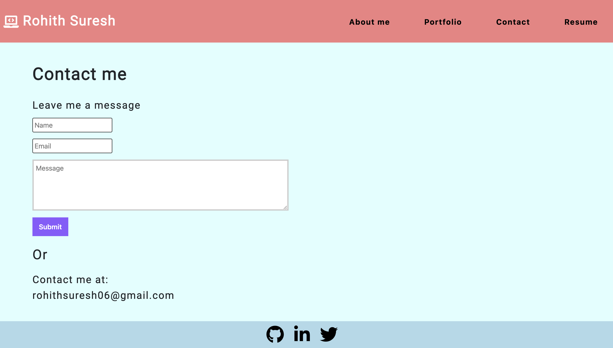
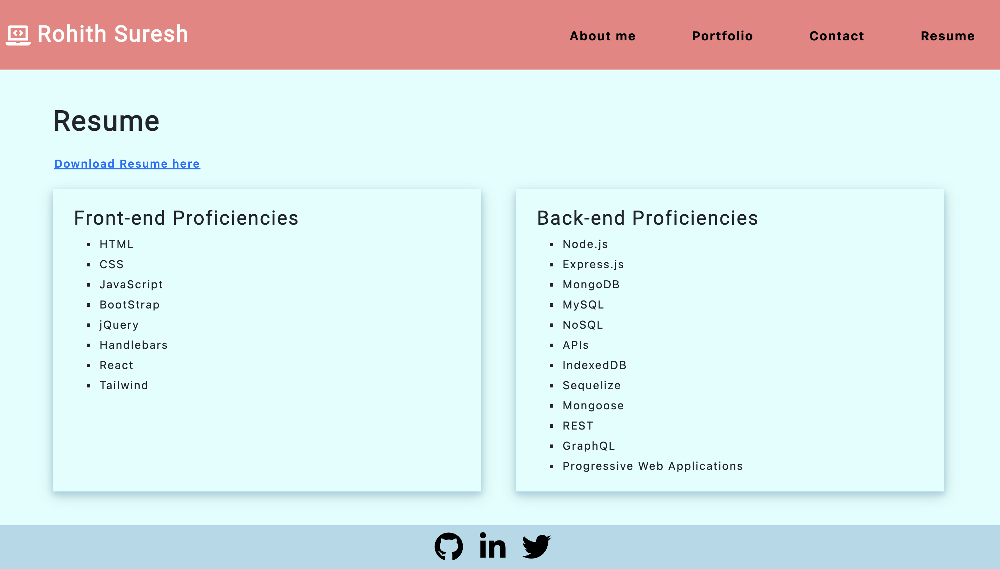

# React Portfolio
           
## Description
A Single page application(SPA) of my personal portfolio which uses react to dynamically display contents of the web page
 
## Table of Contents
- [Installation](#inst)
- [Deployed Application](#deployed-application)
- [Usage](#usage)
- [License](#license)
- [How to Contribute](#contributing)
- [Questions](#questions)
 

  

## Installation
The application can be cloned into your machine using `git pull` command and can be run locally using `npm start` command.

## Deployed Application
Deployed application can be accessed [here]()

## Usage

## License
This application is covered under MIT licensing.

## How to contribute
You can contribute by pushing your code to develop branch for review and integration.
  

## Questions
For any questions you can contact me at:
email: rohitsuresh1@hotmail.com
username: rohitsuresh1 GitHub: https://github.com/rohitsuresh1
  
